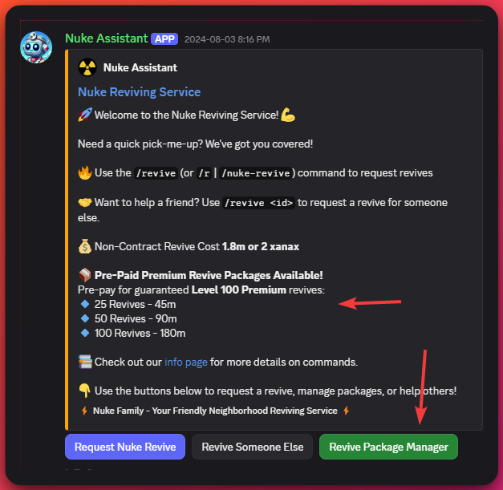
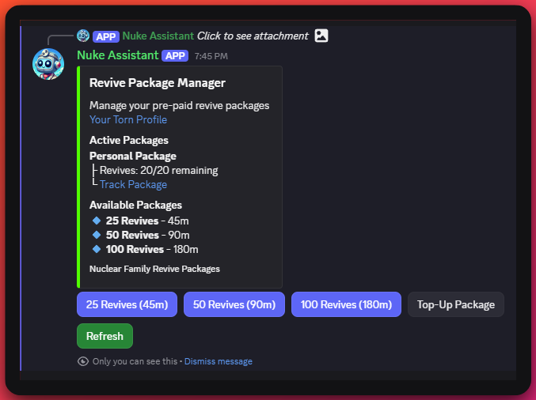

import ReactPlayer from "react-player";
import ExampleVideoUrl from "./example-contract-creation.mp4";

# Discord Bot (Foggy Bot)

## Introduction

Foggy Bot is a Discord bot that interacts with the Torn API and the Nuke Family site. The bot can be used to create new revive contracts, check the status of existing contracts, and more. The bot is currently in development and new features are being added regularly.

## Requesting a Revive Contract

If you're a client looking to request a revive contract, you can create a new ticket on our [Nuclear Central Discord server](https://discord.gg/ukq9gC4mHS). The bot will automatically create a new revive contract for you, based on the information you provide it. It will also provide you with a link to track the live status of your contract. An example of this in action can be seen below:

<ReactPlayer controls url={ExampleVideoUrl} />

:::caution
This section is still a work in progress. More information will be added soon.
:::

## Revive Packages

Revive Packages are pre-paid sets of premium Level 100 revives that you can purchase in advance. This system allows you to pay upfront for multiple revives at a discounted rate, and they'll be automatically available whenever you need them.

### How It Works

1. **Access the Package Manager**: Click the "Revive Package Manager" button on any Nuke Reviving Service embed, or use the button in your DM after requesting a revive.

2. **Choose Your Package**: Select from three available package sizes:

   - **25 Revives** - 45m
   - **50 Revives** - 90m
   - **100 Revives** - 180m

3. **Payment Process**:

   - After selecting a package, you'll receive payment instructions both in the channel and via DM
   - Send the specified amount to **Fogest [2254826]** with the unique payment code included in your message
   - Payment codes expire after a limited time (shown with a Discord timestamp)
   - Payments are automatically detected within 5 minutes

4. **Using Your Revives**: Once payment is confirmed, your revives are automatically credited to your account and will be used automatically whenever a Nuke reviver performs a revive attempt.

5. **Track Your Package**: Each package includes a tracking URL where you can monitor your remaining revives, or view your balance directly in the Revive Package Manager.

6. **Top-Up Anytime**: If your package runs low, use the "Top-Up Package" button to add more revives (25, 50, or 100) to your existing package.

### Important Notes

- Payment codes must be included somewhere in your payment message for automatic detection
- You may be held responsible for covering fees if the payment is mugged
- If your payment code expires, use the "Top-Up" button to generate a new code
- For assistance, visit [Nuclear Central Discord](https://discord.gg/ukq9gC4mHS) and open a ticket

### Package Manager Interface

The Revive Package Manager shows:

- Your active packages with remaining revives
- Total revives purchased
- Direct link to your tracking page
- Options to purchase new packages or top up existing ones
- Refresh button to update your current balance

