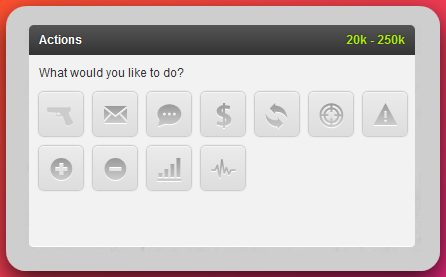
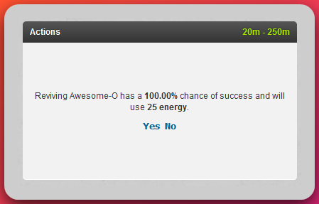
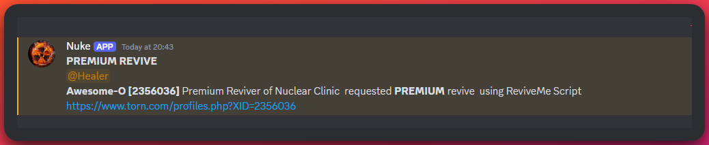
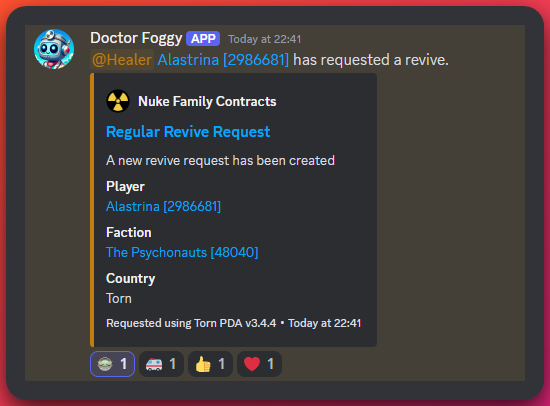
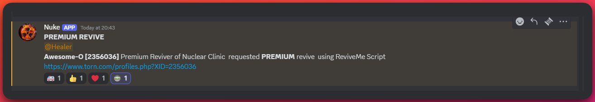
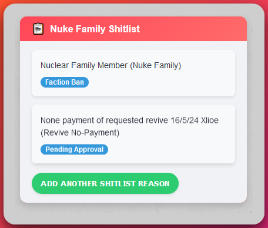
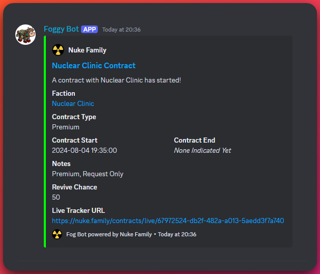
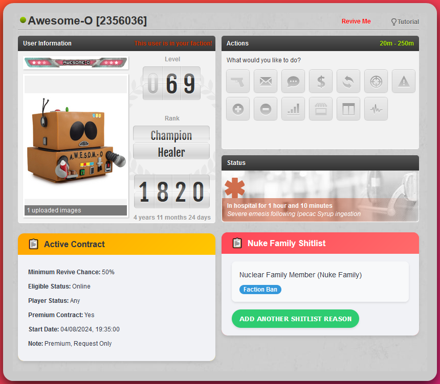

# Reviving Guide

## Basic Info

### Prerequisites

When you have unlocked the revive skill from getting to the Brain
Surgeon Rank in the NPC / City job of Medical, 2,600 Manual 10,000
Intelligence and 4,000 Endurance are required to reach this stage along
with a minimum of five days spent at each level to gain enough job
points for promotion without spending any or 105 total.

### Unlocking the Revive Skill

This will then unlock a new action in the actions box on peoples profiles and mini
profile as shown below.

### Revive Mechanics

When pressing this you will get a revive chance of getting that person
up which depends on your revive skill and how many revives that person
has received within the last 24 hours as each revive will drop their
chance by around 4% (for a 100 skill reviver).

Alongside the percentage chance of reviving you will also return a
percentage of a persons health according to your revive skill, 1% health
at 1 skill up to 100% health at 100 skill.

### Skill Progression

Reaching 100 will take around 1,800 to 2,000 revives. You will gain more
revive skill from reviving those people at a lower chance but at the
same time this will increase the chance of fails.

For raising revive skill I would recommend paying attention to hostile
contracts where you can dump as many revives as you have energy.
Reviving drug overdoses, crime fails and inactive accounts who have left
their revives on. You could also try your luck with selling revives but
with low skill you may find that people will want you to do hostile
revives more than friendly's.

Revives can be classed as two types.

- **Hostile Revives** – These are usually requested by user A on target B.
  These can be for Ranked Wars, Missions or Chain hits most commonly.
- **Friendly** – These are requested by the user for themselves.

Nuke splits the revivers into two categories **Standard** and **Premium**
depending on their skill levels. **Standard revivers** will be from 0-99
skill and then **Premium** will be 100.

## Revive Requests

### Request Methods

There are many ways to request revives from Nuke members. All of the requests are sent to the same server which posts the requests in the Nuclear Central Discord server. The methods are listed below.

#### Discord

There are now two ways to request revives from discord, in any
server where the bot [Nuke Assistant](../reviving/nuke-assistant-revive-bot.md) is added you can use the command `/r`
for personal use or `/revive <id>` to get friends or foes revived, or
press the buttons on the info message to request.

#### Torn Tools

The [Torn Tools](https://www.torn.com/forums.php#/p=threads&f=67&t=16243863) script has an option to request revives and go through to your faction of choice (Nuke)

#### Nuke Userscript (Revive Me)

The Nuke script can be found in the [forum thread](https://www.torn.com/forums.php#/p=threads&f=67&t=16183433&b=0&a=0) and will add a 'Revive Me' to the top of your Torn screen.

#### Torn PDA

[Torn PDA](https://www.torn.com/forums.php#/p=threads&f=67&t=16163503&b=0&a=0) is a mobile application for Android and iOS. Just like Torn Tools this application has a revive request feature built in.

:::tip[Tip]

Detailed information on how to request revives can be found in the [Requesting Revives](../reviving/requesting-revives.md) guide.

:::

### Handling Requests

#### Using Nuclear Central Discord

Once someone has requested a revive it will be sent through to the
[Nuclear Central Discord](https://discord.gg/ukq9gC4mHS).
Most requests will be sent to either the Reving channel or Premium Revive
channel (if a premium reviver) and will look like the examples below. You can turn the Healer
tag on or off by using the channel 'Medical-alerts-on-off' found under
the Reviving section to get discord notifications of requests.

See Revive Request Example

Anyone can then click the links in the message to be taken straight to
the persons profile page where you can then perform the revive.

#### Marking Completed Revives

Once this has been done it is good practice to mark the revive as
complete by adding a Reaction to it on discord. If you have turned them
off please enable them for the server as this will help. This will help
others to mark that the revive has been completed and save them from
duplicating the revive especially in busy times when Torn's API is under
strain around big events or if the person has been put back into the
hospital before the bot checks the API and will clear the revive. In the
example below I have marked the revive with the Baby Yoda and the bot
will then add the Ambulance, Thumbs up and Heart and it will then be
cleared from the channel.

Revive requests can also be marked with a Red X or a Radiation symbol if
they have revives off or are under the effects of Radiation Poisoning
which has to be cleared first. At this time only Neumune tablets can do
this.

## Selling Revives

### Pricing Guidelines

You are free to sell revives and advertise your services in trade chat
or the forums however you wish. While not mandatory, we **highly** suggest maintaining the standard rate of
**$1,000,000 or a Xanax**. Offering revives for lower prices devalues your own energy, and over time leads to reduced rates for everyone. Energy is valuable, and these prices have been the standard for many years on Torn.

### Managing Revive Chances

As the revive chance will reduce the more someone is revived this will
also increase the chance of fails, before undertaking large amounts of
revives it is up to you at what revive chance you will want to start
charging for fails alongside successful revives. This should also be
charged at the full price. As guidance I would suggest starting to
charge fails at _60%_ but also have a hard limit of where you will not
make any more attempts, (I use _40-50%_ for this marker).

Revives through Discord requests are charged at **1.8m or 2 xanax** also.

Those under contracts will not need to pay individuals and this will be
collected at a faction level and paid out to you by your faction
leaders.

### Handling Payment

#### Immediate Payment

Random requests may also come through and it is best practice to not
chase someone 30 seconds after performing a revive for payment.

#### Delayed Payment (War/Chain situations)

If the requester is warring or chaining make a note of the name and keep an eye
on the war or chain and once this has finished send them a polite mail
requesting payment and if you want include the log of the revive. I
usually send the below message

**Subject** – _Revive Request_

**Body** – _Hey can you send payment for the requested revive(s) below Well
done on the chain / war / loss ect (replace as needed)_

**_Copy and paste log(s) of the revives._**

While they are in wars or chaining there maybe lots going on including
watching faction chat, reading faction mails and managing cool downs.
The last thing they will need is someone adding another mail or chat
message chasing a revive payment after 30 seconds. They may also not
have any money on them at the time or easy access and be unable to send
payment until they get a quiet moment.

### Dealing with Non-Payment

For those that don't pay unfortunately there is not much we can do about
this but for this reason we have the Blacklist / Shitlist.

## Blacklist / Shitlist

### Purpose and Usage

The blacklist is an internal tool just for use by Nuke members. This can be found here along with instructions on how to install and use it on the [Nuke Blacklist Userscript info page](https://info.nuke.family/userscripts/)

### Accessing the Blacklist

This will show on the users profile as below. All Nuke members will have
the 'Nuclear Family Member' Faction Ban on them. For users that don't
pay there will be the Revive No-Payment bans. These are generally users
to avoid, unless they are on contract or at your own risk.

### Understanding Blacklist Tags

People will be added for other reasons such as Buy Muggers or Absolute
Scum Lords. Generally the shitlist is there for guidance but it is up to
you if you follow it, but I would recommend paying attention to the none
payers and scum lords tags and follow those closer.

## Contracts

### Types of Contracts

Contracts can be found in a few different places. In your faction
announcement where will be an image with updates on currently running
contracts, on discord in the corresponding Standard or Premium channels
and on the [Nuke Family website](https://nuke.family/contracts).

#### Friendly Contracts

Friendly contracts this will be the faction requesting revives for their
members, these are usually online only so that revives won't be going
onto offline players.

#### Hostile Contracts

Hostile contracts will be on the target faction of a war and will be in
place for the requesting faction to get a large score in a short amount
of time or put-up last minute for a push to score chain bonuses. For
hostiles do not contact the target faction.

### Contract Terms

This will contain some details on who the contract is for, player
status, revive chance, notes, premium or standard and the start and end
dates.

#### Auto vs. Request Contracts

Auto contracts will be for those wanting revives without requesting to
keep up during pushes or for Hostile contracts. For friendlys these will
usually be auto online (green dots) to pick up members of the requesting
faction. For hostiles they will usually be auto offline (grey dots) to
help improve scores, depending on the faction they may also include Away
(orange dots) or online.

Request only will generally come through Discord channels using the
request scripts. Some of these may contact revivers directly if that
player wants to be sat on for extra revives. This is fine to do as it
has been requested and there would be a few requests before hand but
please keep a note of the chat or mail so that if staff see revives
being made without requests it can be seen as a request otherwise these
revives may go uncharged.

#### Online/Offline Status

Online – This will show what status the targets of revives, Online, Away
or Offline

#### Revive Chance Thresholds

Chance – The revive chance of the contract. Please make sure to pay
attention to this as revives that go under this chance will not be
billed. If you are still aiming for 100 skill those who have higher
skill levels may still be in the percentage range where you have gone
past it.

Player Statues – The contract maybe set up just to clear the
Hospitalized status, Hospitalized and mugged or Any.

Notes – This will contain any extra conditions for the contract. It can
range from simple Request Only to limiting revives to certain members or
that it will just be a personal contract for one member. Please check
these as this will affect the contact terms.

Start and End dates – The start times of the contracts and when they
become active.

### Payment Rates for Revivers

Contracts are currently paid out to revivers on the below rates, this
will be paid into your faction balance by your leaders.

Standard contracts – **$1.7m**

Premium Contracts - **$1.9m**

### Handling Contract Revives

#### Checking Contract Details

When a revive is requested you will see a notification in discord along
with a link to their profile. Once you go through and have the Nuke
Shitlist installed you will see the extra active contract box as shown
below. This will give you some extra details and a reminder of the
contract terms with the Revive Chance shown.

In the case above it is a premium contact that has been set up and
requested a revive for. This will be fine for all Premium revivers to do
but should be avoided as much as possible by standards. We understand
accidents can happen but once you notice please do not continue reviving
as this can upset the clients and will not be paid.

If this was a standard contract then both Premium and Standard revivers
are free to pick up the request.

#### Marking Completed Contract Revives

Once you have made the revive, please mark it as completed on discord by
adding a reaction of your choice if the bot has not done this already.

:::note[Guest Written]
This article has been graciously written by [Xlioe [2694994]](https://www.torn.com/profiles.php?XID=2694994). If you have any questions or concerns about the content of this article, please reach out to them.
:::
