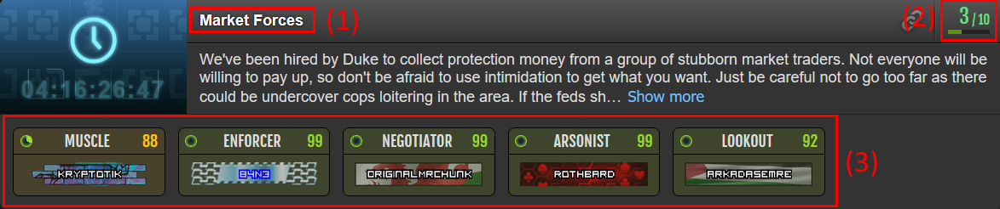

# Torn Medical Guide

:::info[Info]

This guide is specifically related to the **Torn Medical** faction!

:::

## Important Links

- **Nuclear Family Discord:** [Join here](https://discord.gg/FKdWSsv)
- **Nuclear Central Hospital Discord:** [Join here](https://discord.gg/qSHjTXx)
- **TornStats Application:** [Apply here](https://tornstats.com/factions/show/1514/apply)

Welcome to Torn Medical! We're glad to have you. Before you get started, please make sure to read the [Revive Guide](./revive-guide.md) to understand our reviving protocols. It is also mandatory to sign up for the faction on TornStats using the link above.

:::warning[Steps Required of New Members]

1. Join [TornStats](https://tornstats.com/factions/show/1514/apply)
2. Review the [Revive Guide](./revive-guide.md)
3. Join both the [Nuclear Family Discord](https://discord.gg/FKdWSsv) and the [Nuclear Central Hospital Discord](https://discord.gg/qSHjTXx)

:::

## Steadfast Schedule

This schedule outlines our faction's training focus (steadfast) for each month.

| Month                       | Strength | Speed | Defense | Dexterity |
| :-------------------------- | :------: | :---: | :-----: | :-------: |
| **January, May, September** |          |  ☢️   |   ☢️    |           |
| **February, June, October** |          |  ☢️   |         |    ☢️     |
| **March, July, November**   |    ☢️    |       |         |    ☢️     |
| **April, August, December** |    ☢️    |       |   ☢️    |           |

## Faction Rules

1.  **Participate in Contracts:** Active participation in all contracts, especially during Nuke/allied wars, is expected. We understand that smaller contracts fill up quickly, but full participation is required for major events.
2.  **Be Active Daily:** Log in multiple times a day to train, grow your crime experience (by doing crimes), and read faction mail. If you plan to be inactive for 2 or more days, please notify a leader.
3.  **Daily Energy Usage:** Spend a minimum of 500 energy daily on gym training and/or reviving. This includes revives outside of contracts. Your effort improves both your reputation and ours.
4.  **Financial Stability:** Members are expected to reside on a Private Island (PI) and maintain Donator Status within 30 days of joining. You can rent a PI and purchase Donator Status with in-game currency.
5.  **Chains & Ranked Wars:** Contribute at least 1% of hits during chains (e.g., 100 hits in a 10k chain). Use all available energy during ranked wars. Do not revive during ranked wars, as the revive perk is disabled.
6.  **Improve Nerve Bar:** Actively work on increasing your Natural Nerve Bar (NNB) by focusing on safe crimes.
7.  **Torn Stats:** Joining [Torn Stats](#important-links) is mandatory. It helps us track member progress, enforce rules, and manage competitions.
8.  **Organized Crime Policy:** Read and adhere to the [Organized Crime Policy](#organized-crime-oc-policy) detailed below.
9.  **No Scamming, Begging, or Drama:** We maintain a peaceful and respectful environment. Such behavior will not be tolerated.
10. **No Attacking Family:** Do not attack members of the Nuke family without prior arrangement. Exceptions may be made during Torn-wide events like Dog Tags or Elimination, with mutual consent. Mugging family members is strictly prohibited.
11. **Be Respectful:** Treat all members with honesty and respect.
12. **Protect Our Reputation:** Do not engage in conflicts that could tarnish Torn Medical's reputation.
13. **Real Life First:** We understand that real-life events can be unpredictable. If you need to be away unexpectedly, please inform leadership.
14. **Confidentiality:** Do not disclose the names of factions contracted with Torn Medical or Nuclear Central to anyone outside of NUKE.
15. **Racket Items:** Do not use items obtained from rackets (e.g., Erotic DVDs, Moonshine). These are used to fund the faction family.
16. **Have Fun!**

---

## Organized Crime (OC) Policy

### Importance of OCs

Organized Crimes (OCs) are crucial for our faction's growth. They contribute significantly to our respect gains, increase your crime experience, and generate income that funds faction-wide benefits.

### OC 2.0 Income

With the transition to OC 2.0, many factions have seen nearly double the income compared to OC 1.0, both for the faction itself and for individual members. The faction will take a 10% cut of OC 2.0 income to cover item costs (especially for higher-level crimes), and members will receive the remaining 90% divided evenly among participants.

### How to Join Crimes

**THE BIGGEST CHANGE: You must now join your own OCs. Leadership cannot place you in a crime, but participation is still mandatory per faction policy.**

_Above: Example OC screen.  
1️⃣ Crime title  
2️⃣ Crime level (e.g., 3/10 = Level 3 crime)  
3️⃣ Roles for the crime, each showing your Checkpoint Pass Rate (CPR) in the top right._

- **Crime Spawning:** Crimes of different levels (1-2, 3-4, 5-6, 7-8) are spawned regularly by leadership to ensure there are always OCs available for members to join. If you notice that no crimes are available, please notify leadership so new ones can be started. Always prioritize filling existing crimes before requesting new ones.
- **Joining Requirements:**
  - Check your **Checkpoint Pass Rate (CPR)** before joining any OC.
  - For **Level 7 crimes and below:** Join any slot where you have **70+ CPR**.
  - For **Level 8 crimes:** You may join slots where you have **60+ CPR** (these are much harder with expected ~65% success rates, but offer significantly higher payouts).
  - Always join the highest level OC you qualify for and fill existing crimes before starting new ones.
  - If there are multiple high level crime options to join, it is suggested you join any that currently have no members, as having one person in a role for the planned crime gets the planning timer started!
- **Crime Items:** Some roles require specific items. When you hover or click on a role in the OC screen, it will display any required items for that role. Make sure you have the required item in your inventory before the crime completes. Not all roles require items-if none are listed, you do not need to bring anything extra. You can also check the [OC Items Spreadsheet](https://docs.google.com/spreadsheets/d/1LKEVECElJm89s-MoiBeTkvqVPeNwIeAQMCI9bdPLI64/edit?gid=1447577706#gid=1447577706) for a full list.
- **Planning Time:** Each slot takes 24 hours to plan, starting from the leftmost position. The crime progresses only if someone occupies the next slot when the previous one finishes planning. Total planning time equals 24 hours multiplied by the number of participants.
- **Crime Execution:** Once all planning stages complete, the crime runs automatically if all participants have the required items and are in Torn (not hospitalized or jailed).

### OC 2.0 Policies

- **Member Responsibility:** You are responsible for joining a new crime after your previous one completes. The faction requirement to participate in OCs remains in effect.
- **Item Requirements:**
  - Check which slots require items using the [OC Items Spreadsheet](https://docs.google.com/spreadsheets/d/1LKEVECElJm89s-MoiBeTkvqVPeNwIeAQMCI9bdPLI64/edit?gid=1447577706#gid=1447577706).
  - If an item is consumed by the crime, use the `/bank request` command with proof of purchase in the "amount/items to withdraw" field for reimbursement at market rates.
  - If an item is not consumed, you are responsible for purchasing and maintaining it.
- **Slot Removal:** Leadership has permissions to remove you from a crime slot if you don't meet the requirements. If this happens, rejoin in an appropriate slot for your skill level.
- **Warnings:** Any action that delays a crime will result in a warning, including:
  - Not being in Torn when the crime runs
  - Being hospitalized or jailed when the crime runs
  - Not having the required item when the crime runs

### OC 2.0 Payouts

All OC levels use a 10% faction cut with the remaining 90% divided evenly among participating members.

- **Level 7 OCs:** Equivalent to high Planned Heist (PH) / low Planned Assassination (PA) payouts. Members currently in PHs will likely start earning more in OC 2.0.
- **Level 8 OCs:** Equivalent to high PA payouts and above. Most PA members (except former PA leads) will earn more per crime. Level 8 crimes run every 6 days, providing more frequent payouts.
- **Level 9 & 10 OCs:** Not yet released. Expected to be even more challenging with potentially lower success rates but significantly higher payouts.

### OC Cancellation

Canceling an OC without prior permission from OC managers, Committee, or Leadership is strictly prohibited and will result in a minimum fine of 10 points.

### OC Delay Policy

Delays hurt the faction's progress. Warnings and fines will be issued for delays caused by:

- Traveling when an OC is due to run
- Overdosing on drugs without setting revive permissions to "Allow everyone"
- Being hospitalized from a failed crime and not getting out
- Not having the required item in your inventory when the crime runs

**Exceptions:** If delayed by an action taken against you (e.g., arrested, overseas mugging), send a copy of the event log to Leadership to be exempt from fines. No fines are issued during Torn-wide events that require travel or hospitalization.

### Useful Resources

- [Ched's OC 2.0 Announcement](https://www.torn.com/forums.php#/p=threads&f=1&t=16438781&b=0&a=0)
- [Basic Crime Layout Guide](https://www.torn.com/forums.php#/p=threads&f=61&t=16439019&b=0&a=0)
- [OC Items Spreadsheet](https://docs.google.com/spreadsheets/d/1LKEVECElJm89s-MoiBeTkvqVPeNwIeAQMCI9bdPLI64/edit?gid=1447577706#gid=1447577706)
- [Item Source Guide](https://www.torn.com/forums.php#/p=threads&f=2&t=16428538&b=0&a=0&start=320&to=25452603)
