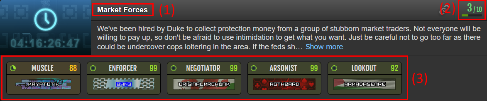

# Torn Medical Guide

:::info[Info]

This guide is specifically related to the **Torn Medical** faction!

:::

## Important Links

- **Nuclear Family Discord:** [Join here](https://discord.gg/FKdWSsv)
- **Nuclear Central Hospital Discord:** [Join here](https://discord.gg/qSHjTXx)
- **TornStats Application:** [Apply here](https://tornstats.com/factions/show/1514/apply)

Welcome to Torn Medical! We're glad to have you. Before you get started, please make sure to read the [Revive Guide](./revive-guide.md) to understand our reviving protocols. It is also mandatory to sign up for the faction on TornStats using the link above.

:::warning[Steps Required of New Members]

1. Join [TornStats](https://tornstats.com/factions/show/1514/apply)
2. Review the [Revive Guide](./revive-guide.md)
3. Join both the [Nuclear Family Discord](https://discord.gg/FKdWSsv) and the [Nuclear Central Hospital Discord](https://discord.gg/qSHjTXx)

:::

## Steadfast Schedule

This schedule outlines our faction's training focus (steadfast) for each month.

| Month                       | Strength | Speed | Defense | Dexterity |
| :-------------------------- | :------: | :---: | :-----: | :-------: |
| **January, May, September** |          |  ☢️   |   ☢️    |           |
| **February, June, October** |          |  ☢️   |         |    ☢️     |
| **March, July, November**   |    ☢️    |       |         |    ☢️     |
| **April, August, December** |    ☢️    |       |   ☢️    |           |

## Faction Rules

These are the specific, enforceable rules. See [General Guidelines](#general-guidelines) for our broader expectations.

1.  **Daily Energy Usage:** Spend a minimum of 750 energy daily on gym training and/or reviving.
2.  **Financial Stability:** Reside on a Private Island (PI) and maintain Donator Status within 30 days of joining. See the [Private Island Rental Program](#private-island-rental-program) for discounted faction rates.
3.  **Chains & Ranked Wars:** Contribute at least 1% of hits during chains (e.g., 100 hits in a 10k chain). Use all available energy during ranked wars. Do not revive during ranked wars, as the revive perk is disabled.
4.  **Torn Stats:** Joining [Torn Stats](#important-links) is mandatory.
5.  **Organized Crime Policy:** Read and adhere to the [Organized Crime Policy](#organized-crime-oc-policy) below.
6.  **Confidentiality:** Do not disclose the names of factions contracted with Torn Medical or Nuclear Central to anyone outside of NUKE.

## General Guidelines

These are the standards we expect of every member:

- **Participate in contracts**, especially during Nuke/allied wars. Smaller contracts fill quickly, but full participation is required for major events.
- **Be active daily** — train, do crimes to grow your crime experience, and read faction mail. Notify a leader if you'll be inactive for 2 or more days.
- **Improve your Natural Nerve Bar (NNB)** by focusing on safe crimes.
- **No scamming, begging, or drama.** Treat all members with honesty and respect.
- **Don't attack family** without prior arrangement. Exceptions may be made during Torn-wide events like Dog Tags or Elimination, with mutual consent. Mugging family is prohibited.
- **Protect our reputation** — avoid conflicts that could tarnish Torn Medical's name.
- **Real life first.** If you need to be away unexpectedly, let leadership know.
- **Don't use racket items** (e.g., Erotic DVDs, Moonshine). These fund the faction family.

## Faction Banking

You can store your money in the faction vault and withdraw it whenever you need it. When you want to withdraw, please request it using one of the two methods below rather than asking in faction chat:

- **Discord command:** Use the `/bank request` command in either of the [Nuclear Family Discord servers](#important-links). Your request is sent to a private channel that only bankers can see.
- **Website:** Submit a banking request at [nuke.family/faction/bank-request](https://nuke.family/faction/bank-request). You'll need to be logged into an account on the site — if you don't have one, you can quickly create one.

## Private Island Rental Program

Need a PI to meet the financial stability rule? The faction rents private islands to members at discounted rates, available on our faction-owned island. Contact [Fogest [2254826]](https://www.torn.com/profiles.php?XID=2254826) to get set up with one of these packages:

### 3,725 Happiness Package

| Duration | Rate     | Total      |
| :------- | :------- | :--------- |
| 10 days  | 700k/day | 7m total   |
| 30 days  | 625k/day | 18.75m total |
| 100 days | 500k/day | 50m total  |

### 4,225 Happiness Package

| Duration | Rate     | Total      |
| :------- | :------- | :--------- |
| 10 days  | 925k/day | 9.25m total |
| 30 days  | 875k/day | 26.25m total |
| 100 days | 750k/day | 75m total  |

---

## Organized Crime (OC) Policy

Organized Crimes (OCs) drive our faction's respect gains, your crime experience, and faction income. **You must join your own OCs — leadership cannot place you, but participation is mandatory.**

:::danger[Joining Requirements — Check Your CPR First]

Before joining any OC, check your **Checkpoint Pass Rate (CPR)** for the slot:

- **Level 7 and below:** Join any slot where you have **70+ CPR**.
- **Level 8:** Join slots where you have **60+ CPR**.

Always join the highest level OC you qualify for, and fill existing crimes before starting new ones.

:::

How to join crimes (CPR, items, planning & execution)

_Above: Example OC screen.  
1️⃣ Crime title  
2️⃣ Crime level (e.g., 3/10 = Level 3 crime)  
3️⃣ Roles for the crime, each showing your Checkpoint Pass Rate (CPR) in the top right._

- **Crime Spawning:** Leadership regularly spawns crimes of different levels (1-2, 3-4, 5-6, 7-8). If none are available, notify leadership. Always fill existing crimes before requesting new ones.
- **Empty crimes first:** If multiple high-level crimes are open, join one with no members — a single occupant starts the planning timer.
- **Crime Items:** Some roles require specific items, shown when you hover or click the role. Make sure you have the item in your inventory before the crime completes. If no items are listed, you don't need to bring anything.
- **Planning Time:** Each slot takes 24 hours to plan, starting from the leftmost position. The crime progresses only if the next slot is occupied when the previous one finishes. Total planning time = 24 hours × number of participants.
- **Crime Execution:** Once planning completes, the crime runs automatically if all participants have their items and are in Torn (not hospitalized or jailed).

### OC Policies

- **Member Responsibility:** Join a new crime after your previous one completes. OC participation is a faction requirement.
- **Item Reimbursement:** If an item is consumed by the crime, use `/bank request` with proof of purchase in the "amount/items to withdraw" field for reimbursement at market rates. If an item is not consumed, you maintain it yourself.
- **Slot Removal:** Leadership may remove you from a slot if you don't meet the requirements. If this happens, rejoin an appropriate slot.

### OC Payouts

The faction takes **10%** of OC income; the remaining **90%** is divided evenly among participating members.

### OC Cancellation

Canceling an OC without prior permission from OC managers, Committee, or Leadership is strictly prohibited and will result in a minimum fine of 10 points.

### OC Delay Policy

Delays hurt the faction's progress. Warnings and fines will be issued for delays caused by:

- Traveling when an OC is due to run
- Overdosing on drugs without setting revive permissions to "Allow everyone"
- Being hospitalized from a failed crime and not getting out
- Not having the required item in your inventory when the crime runs

**Exception:** No fines are issued during Torn-wide events where applicable.

### Useful Resources

- [Ched's OC 2.0 Announcement](https://www.torn.com/forums.php#/p=threads&f=1&t=16438781&b=0&a=0)
- [Basic Crime Layout Guide](https://www.torn.com/forums.php#/p=threads&f=61&t=16439019&b=0&a=0)
- [Item Source Guide](https://www.torn.com/forums.php#/p=threads&f=2&t=16428538&b=0&a=0&start=320&to=25452603)
