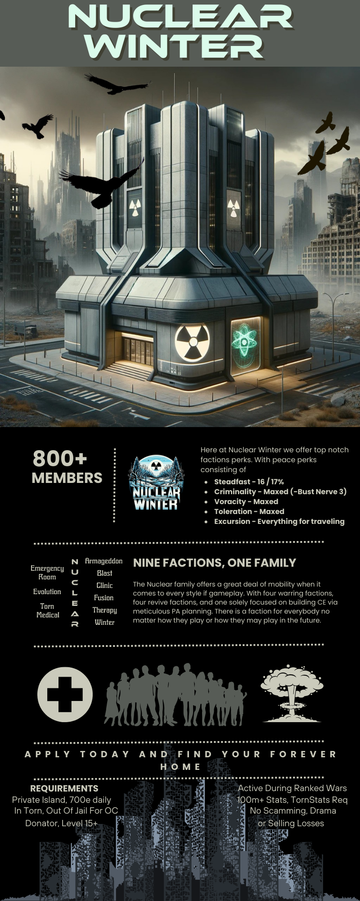
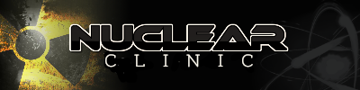

# Our Family

The Nuclear Family is made up of a set of **9** factions that work together to grow as players. Each faction has its own unique set of rules and requirements, but all factions share a common goal of growth. We have [**4 training factions**](#training-factions) focused on gym training and ranked warring. We have [**4 reviving factions**](#revive-focused-factions) with slightly differing requirements and focuses. And finally we have one focused heavily on PA's and is the top dog when it comes to everything [**crime related**](#crime-focused-faction).

## Training Factions

### [Nuclear Fusion](https://www.torn.com/factions.php?step=profile&ID=12094/)

> We are a highly active, ambitious, team based faction.
> If you are unable to commit, do not apply!
> We accept players spending a minimum of 1000 energy per day, between training, attacking - whatever your chosen area is.
> We RW often, high payout percent and pay per hit with non-war and assists paid too.
> Free refills for top trainers and free Xanax for top Xanax ratio.
> We do not expect any minimum battle stats although applicants with lower stats are expected to be very active with solid growth. 

### [Nuclear Winter](https://www.torn.com/factions.php?step=profile&ID=16282/)

> Nuclear Winter offers top notch faction perks. With peace perks consisting of: 
> - Steadfast - 16/17%
> - Criminality - Maxed (Bust Nerve 3)
> - Voracity - Maxed
> - Toleration - Maxed
> - Excursion - Everything for traveling

	
See their large promo poster giving all the details

	

### [Nuclear Blast](https://www.torn.com/factions.php?step=profile&ID=8085/)

> Nuclear Blast is a hybrid Ranked War/Training faction. Other factions are Fusion - (main faction), Armageddon (growth/ranked wars), Nuclear Winter (growth/ranked wars), and Nuclear Clinic, Nuclear Therapy, Torn Medical & Emergency Room (revive focused)
>
> We look for members that are very active and login multiple times a day. Inactive members will be kicked.

Requirements

We ask that you:
- Train an average of 1000E per day
- Have 100 million battle stats and 35 NNB
- Stack and participate in ranked war twice in seven weeks
- Are in Torn when OC is due
- Join us on Torn Stats
- Work on your NNB by sticking with safe crimes
- Fill 3 or more faction blood bags per day

### [Nuclear Armageddon](https://www.torn.com/factions.php?step=profile&ID=8954/)

> We are a highly active, ambitious, team based faction.
> If you are unable to commit, do not apply!
> 
> We accept players spending a minimum of 500e to 1000e per day training on average.
> 
> We will enlist in ranked wars. Profit sharing from Cache Sales will be split with faction members based on participation. Therefore, we expect a reasonable performance and 100% energy uses towards RW's.

## Crime Focused Faction

### [Evolution (Evo)](https://www.torn.com/factions.php?step=profile&ID=366/)

> Evolution is a crime focused faction and is part of the Nuclear family. With 25 PA teams, Evolution is a major force when it comes to CE building.

Exepectations

- Be Active daily.
- Be PA ready (ea 35k), and continue to build on your CE.
- Willingness to participate in RW, real life allowing (rewards range between 90%-100%).
- Use your booster CD to the max. 
- Train as much energy as you can.
- Donator Status.

Benefits

Premium CE growth environement:
- PA spot for everyone, PA pay even on fails (35/25/20/15), and bonus for law firm employees.
- Unlimited free beers & LBC after PAs.
- High RW pay (90% to 100%).
- Premium weapons for missions, easy merit hunting, and of course wars.
- A chilled and drama-free environment.
- Friendly Competitions.

## Revive Focused Factions

### [Nuclear Therapy](https://www.torn.com/factions.php?step=profile&ID=13851/)

**Recruiting** Hybrid Revivers with 5m + battle stats, all skill levels accepted! 

> What we offer: 
> - Regular paid revive contracts, including paid failed revives.
> - Membership into the largest and most experienced revive family.
> - Great faction perks.
> - And much more!

Requirements

- 500e+ spent in the gym daily and/or 100+ revives a week- Attempt to help on revive contracts
- Achieve 1% of hits in chains and use all available energy in ranked wars
- Must own or rent a PI and be financially self-sufficient. (Positive net worth and donator status)
- Must be 5m battle stats or higher
- Be in Torn and out of hospital for OCs
- Drama free (positive friend ratio and no forum drama)
- Join Torn Stats (API registered) and Discord servers
- Daily activity and let leadership know about any upcoming absences. We'll work with you!

### [Nuclear Clinic](https://www.torn.com/factions.php?step=profile&ID=21028/)

> Nuclear Clinic is a reviving faction within this family.
> 
> We don't do ranked wars but have monthly chains.

Requirements

We look for members that are active and login multiple times a day. Inactive members / members that don't join TornStats will be kicked.
There is no BS minimum!

We ask that you: 

- Have the ability to revive 
- Join us on TornStats
- Are in Torn when OC is due
- Participate in chains
- Drama free
- Donator Status
- And be active (f.e. 500E used daily on average)

### [Torn Medical](https://www.torn.com/factions.php?step=profile&ID=17133/)

> Torn Medical is a part of Nuclear Family, and Nuclear Central, which is possibly the biggest reviving group in Torn. Torn Medical is currently HOF #2 in terms of revives. We are on the path to becoming a hybrid reviving faction.

Requirements

- Actively participate in the revive contracts.
- Spend 500+ energy daily, on average, either reviving or training in the gym.
- Achieve 1% of hits in chains and use all available energy in ranked wars.
- Actively work to improve your NNB/Crime Experience by sticking with safe crimes.
- Be financially self-sufficient enough to own/rent PI (with or without spouse) & have Donator status.
- Be active daily, logging in multiple times a day is recommended.
- Have a good reputation in Torn.
- Join our Tornstats & Discord Servers.
- Be in Torn and out of hospital when OC is due.
- Scamming, Begging or Drama are not tolerated.

Benefits

- Free Xanax & Energy refills during RW/Wars
- Free medical items (SFAK/FAK), Beer & Lollipops.
- Access to loan Weapon & Armour from faction armory
- 85% of RW cache rewards split between members, based on participation.
- 95% of successful PA payment split between members, based on their spot.
- Opportunity to participate in revive contracts from Nuclear Central to earn money.
- Opportunity to participate in faction/family-wide events/contests/giveaways.
- Movement between Nuke family factions for use of different faction upgrades.
- Faction banking with active bankers around the clock to help you protect your money
- Active family Discord server with over 900 members, with dedicated stock chat and alert channels.

### [Emergency Room](https://www.torn.com/factions.php?step=profile&ID=9745/)

> Looking for active team players

Requirements

1. Have revive skill unlocked.
2. Write something in your application.
3. Quickly level revive skill to 100 after admission.
4. Use 500e daily on revives or gym
5. Donator or Subscriber
6. Log in daily

