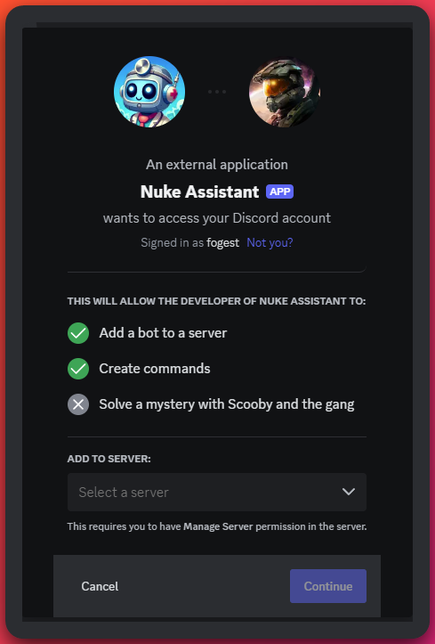
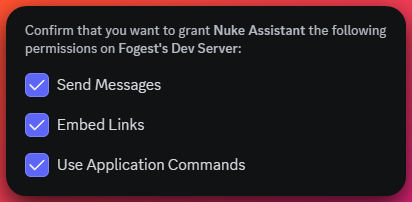
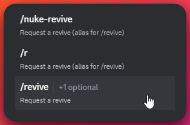
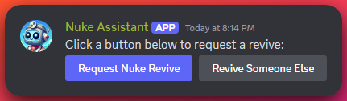

# What is the Nuke Assistant?

The Nuke Assistant is a bot that anyone can add to their server. It has a couple commands currently that can be used. The purpose of it is to replace the old Nuclear Nurse bot that made use of old `!` style commands. This new bot makes use of the new Discord "[Slash Commands](https://support.discord.com/hc/en-us/articles/1500000368501-Slash-Commands-FAQ)". This new bot will have more features added and will be updated more frequently. The old bot hit a max of 100 servers and as it is using the old `!` style commands, it will be unable to go beyond 100 servers. This new bot using the new system and will have additional features. With this new bot players can request revives via the commands `/revive` or `/r` or `/nuke-revive`. Players can also make a button that can be used to request a revive via the command `/make-revive-me-button`.

Adding the button can allow your members to quickly request revives with just a single button press. See more details on the commands in the [Commands](#commands) section below.

:::tip[Too Long, Didn't Read (TLDR) ?]
Don't have time to read all this blabber? Just want to add the bot to your server? Click this link to add the bot to your server: [Discord Nuke Assistant Bot Invite link (click me)](https://discord.com/oauth2/authorize?client_id=1266843389521821749)

Then just use the `/revive` command to request a revive or use the `/make-revive-me-button` command to make a button that can be used to request a revive.
:::

## Adding the Nuke Assistant to your server

All you have to do is visit the [Discord Nuke Assistant Bot Invite link (click me)](https://discord.com/oauth2/authorize?client_id=1266843389521821749) and select the server you want to add it to. You must have the "`Manage Server`" permission in the server you are trying to add the bot to. If desired you can adjust the bots application command permissions in case you want to limit who can request revives. However this is likely not something you'll want to do. The bots messages are sent in private responses when the command is used, so there is no need to worry about any spam in your server.

The bot only requires these minimal permissions to function properly. It does not need any additional permissions to function. If you are trying to use the [`/make-revive-me-button`](#make-revive-me-button) command you will need the "Manage Channel" permission in the channel you are trying to use the command in. The bot will also need to be able to send messages in the channel you are trying to use the command in so that it can insert the button.

## Commands

### `/revive <?torn_player_id>` (`/r` | `/nuke-revive`)

Want to request a revive? Use this command to request a revive from us. You can also use `/r` or `/nuke-revive` as shortcuts for this command. If you provide a Torn player ID, we will attempt to revive that player. If you do not provide a Torn player ID, we will attempt to revive you.

### `/make-revive-me-button`

Want to make a revive me button? Use this command to get a button that you can use to request a revive from us. You must have the "Manage Channel" permission in whatever channel you are trying to use this command in to insert the button. This is to ensure there isn't accidental usage of the button occuring and that whoever is adding it also can remove it if needed. The button works the same as running `/revive`.

