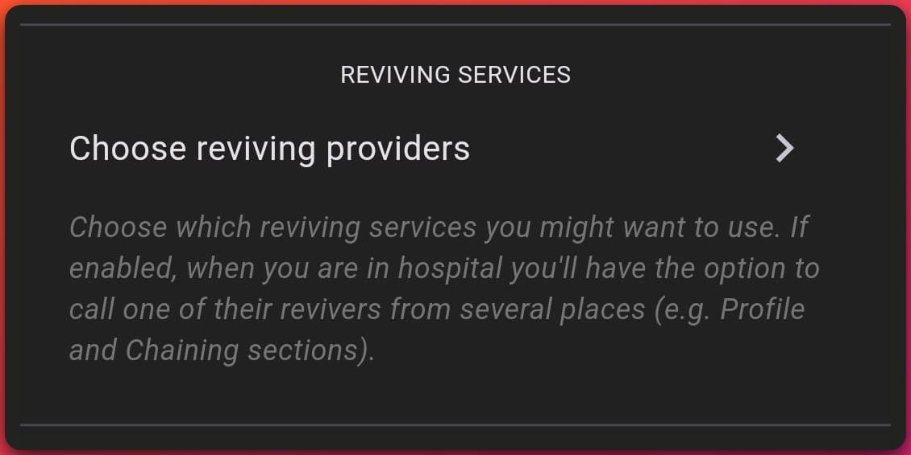
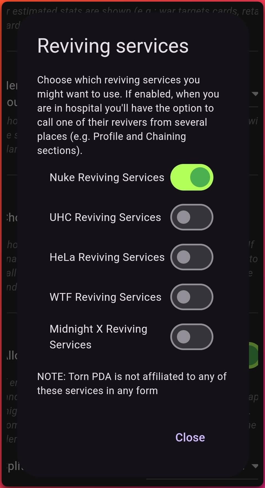
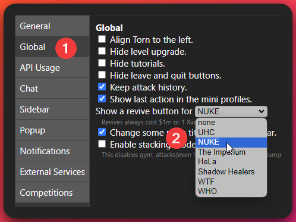

# How to Request Revives

Revives can be requested from us in 4 different ways, each with their own benefits and drawbacks. The 4 methods are listed below

- [How to Request Revives](#how-to-request-revives)
	- [Nuke ReviveMe Userscript](#nuke-reviveme-userscript)
	- [Torn PDA](#torn-pda)
	- [Torn Tools](#torn-tools)
	- [Nuke Assistant Discord Bot](#nuke-assistant-discord-bot)

## Nuke ReviveMe Userscript

The [Nuke ReviveMe userscript](https://www.torn.com/forums.php#/p=threads&f=67&t=16183433&b=0&a=0) is a script that can be installed in your browser to help you request revives. It is a simple script that adds a button to the revive page that will automatically fill in the form for you. This script is only available for the browser version of Torn.

:::note[Note]
At the moment this script uses our old revive request system. It still works properly, however we will soon be providing a new script that can be installed which makes use of the new systems the other tools use
:::

## Torn PDA

The [Torn PDA](https://www.torn.com/forums.php#/p=threads&f=67&t=16163503&b=0&a=0) is a mobile application for Android and iOS. Just like [Torn Tools](#torn-tools) this application has a revive request feature built in.

You'll want to make sure that you have your TornPDA settings set to use the "Nuke Reviving Services". You'll find such a section in the settings of the app to change reviving providers. Typically by default you are already on our services unless you changed this. Images of how to change this setting can be found below in the spoiler.

How to change the TornPDA revive settings

When you are in the hospital you will see a "Request Revive" button on your main Torn PDA dashboard. When you click this it will send us a revive request.

## Torn Tools

The [Torn Tools](https://www.torn.com/forums.php#/p=threads&f=67&t=16243863) browser extension has revive requesting built-in just like [Torn PDA](#torn-pda). This works similar to how TornPDA works in that you'll need to change your settings to make sure our services are selected. When you're in the hospital you'll have a button you can press to request a revive. This request will get forwarded to us. If you have any contract in progress revivers will be made aware one is active when this request is made.

How to change the Torn Tools revive settings

## Nuke Assistant Discord Bot

The [Nuke Assistant Discord Bot](./nuke-assistant-revive-bot.md) is a bot that can be added to your server. It has a couple commands currently that can be used. The purpose of it is to replace the old Nuclear Nurse bot that made use of old `!` style commands. This new bot makes use of the new Discord "[Slash Commands](https://support.discord.com/hc/en-us/articles/1500000368501-Slash-Commands-FAQ)". Please check out the [Nuke Assistant Revive Bot](./nuke-assistant-revive-bot.md) page for more information on how to add it to your server.

:::caution[Recent Change]
We recently switched to using a new bot for requesting revives. If you were previously using the Nuclear Nurse bot, you can continue using it. However, we recommend switching to the new bot as it _will_ have more features added and will be updated more frequently. The old bot hit a max of 100 servers and as it is using the old `!` style commands, it will be unable to go beyond 100 servers. This new bot using the new system and will have additional features.

To switch to the new bot you can simply follow the instructions on the [Nuke Assistant Revive Bot](./nuke-assistant-revive-bot) page to add it to your server. And then feel free to remove or keep the old bot as you see fit.
:::
