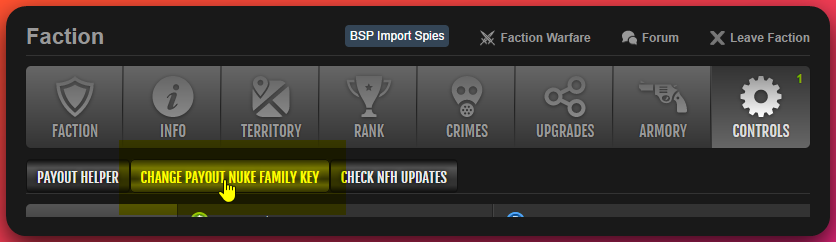
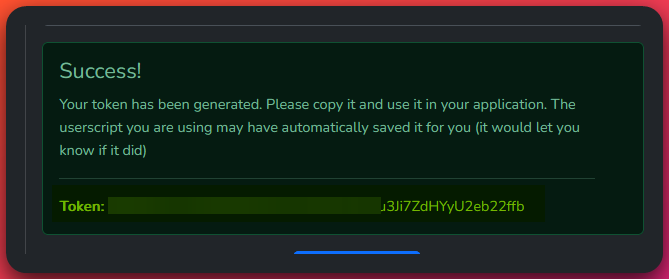

# Installation

- Install the script from [GitHub by clicking here](https://github.com/Fog-Development/nuke-family-helper-script/raw/master/nuke-family-helper.user.js). Your userscript manager should prompt you to install it.
  :::tip
  It is suggested that you make sure automatic updates are enabled in your userscript manager so you always have the latest version. The script will also check for updates and prompt you to update if a new version is available.
  :::
- When you visit your first player profile the will ask if you'd like to generate a Nuke Family site API key. It will take you to the Nuke Family site to generate a key and then save it in the script automatically. Please see the below troubleshooting section if you have any issues with this process.

#### Troubleshooting

	
Issues with generating or saving the API key?

  - If you have any issues with generating or saving the API key, you can manually enter it by visiting the your [Faction page and clicking the "Controls"](https://www.torn.com/factions.php?step=your&type=1#/tab=controls) button. There is a `Change Payout Nuke Family Key` button you can use to set a key manually or to change an existing key. See image below for reference.
    
  - To generate the Nuke Family Key itself, visit the [Nuke Family Key Generation page](https://nuke.family/auth/token-generation). Label the application name as you see fit, and click the "Generate Token" button. Copy the key and paste it into the above mentioned spot.
    
    

Please feel free to reach out to me on Discord if you have any issues with the script or need help with anything. My Discord username is `Fogest`.
