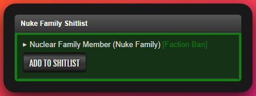
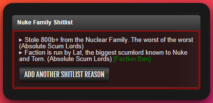
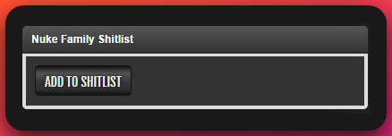
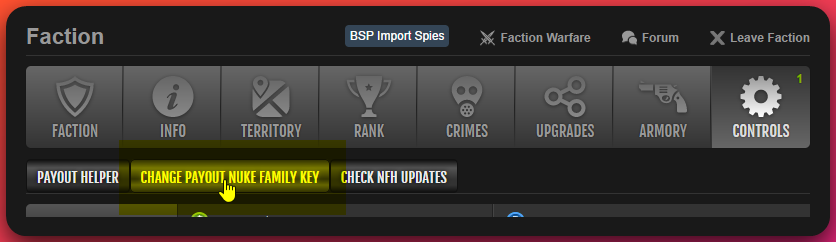
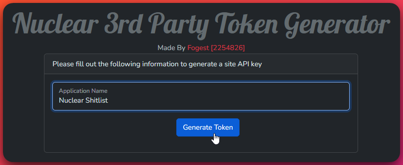
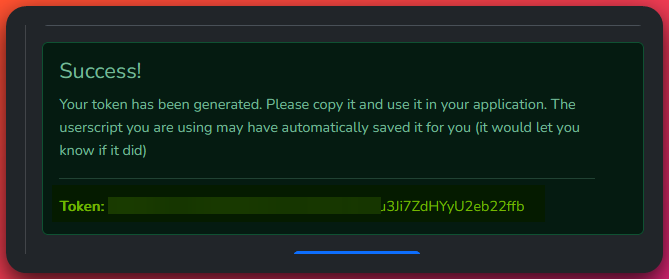
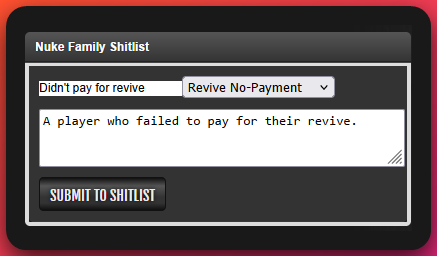

# Nuke Blacklist Userscript

The Nuclear Shitlist (_aka Nuclear Blacklist_) allows you to add people to a blacklist under various categories and reasons. Any users added to the blacklist are submitted for approval and will be reviewed by staff. This helps ensure that the blacklist is not abused and that users are not added for invalid reasons. In future versions of the script, you will be able to pick and choose which categories you care about. If you don't care to see blacklisted buymuggers, no problem, you'll be able to disable that category.

Please continue reading by hitting the "Next" button below. If you are looking for installation instructions, please click the "Installation" link in the sidebar. If you are looking for requirements, please click the "Requirements" link in the sidebar.

## Requirements

- [Tampermonkey](https://www.tampermonkey.net/) (Chrome or Firefox) or [Greasemonkey](https://addons.mozilla.org/en-CA/firefox/addon/greasemonkey/) (Firefox)
- You must be a member of the Nuke Family and registered on the [Nuke Family website](https://nuke.family/)
- You must have a [Nuke Family API key](https://nuke.family/auth/token-generation). The userscript will assist you in generating a Nuke Family site API key and saving it in the script.

## Installation

- Install the script from [GitHub by clicking here](https://github.com/Fog-Development/nuke-family-helper-script/raw/master/nuke-family-helper.user.js). Your userscript manager or TornPDA should prompt you to install it after following the link.
  :::tip
  It is suggested that you make sure automatic updates are enabled in your userscript manager so you always have the latest version. The script will also check for updates and prompt you to update if a new version is available.
  :::
- When you visit your first player profile the will ask if you'd like to generate a Nuke Family site API key. It will take you to the Nuke Family site to generate a key and then save it in the script automatically. Please see the below troubleshooting section if you have any issues with this process.

### Verifying Installation

You can verify the installation is working by visiting a players profile, you should see a `Nuke Family Shitlist` box. If you do not see this box, please refer to the [Troubleshooting](#troubleshooting) section. The box can look a few different ways:

	
Box Examples

    	**Nuke Family Member**\
    	

    	**Blacklisted Person (Both player and faction blacklist reasons)**\
    	

    	**Not Blacklisted**\
    	

### Troubleshooting

	
Issues with generating or saving the API key?

  - If you have any issues with generating or saving the API key, you can manually enter it by visiting the your [Faction page and clicking the "Controls"](https://www.torn.com/factions.php?step=your&type=1#/tab=controls) button. There is a `Change Payout Nuke Family Key` button you can use to set a key manually or to change an existing key. See image below for reference.
    
  - To generate the Nuke Family Key itself, visit the [Nuke Family Key Generation page](https://nuke.family/auth/token-generation). Label the application name as you see fit, and click the "Generate Token" button. Copy the key and paste it into the above mentioned spot.
    
    

Please feel free to reach out to me on Discord if you have any issues with the script or need help with anything. My Discord username is `Fogest`.

## Usage

After installing the script you will be able to see blacklisted members and add your own.

### Adding a Blacklist Entry

Click the "Add to Shitlist" button on a players profile to add them to the blacklist. You will be prompted to select a category and enter a reason (see image below).

Once you submit the entry, it will be added to the blacklist and submitted for approval. Blacklist entries that still require approval will still appear on the blacklist, but will be marked as pending approval and will appear slightly different. This allows members to see submissions right away that may be time sensitive, but still highlight that they are pending approval and may not be verified yet.

#### Blacklist Categories

The following categories are available for at the individual player level:

- **Buy Mugger** - Someone who has attempted to mug you after buying an item. We try and reserve this for the most egregious cases.
- **Revive No-Payment** - Someone who has not paid for a revive. Please try and resolve this with the player first and give them around 24 hours to pay before adding them.
- **Absolute Scum Lord** - Someone who has done something so egregious that they deserve to be on the blacklist. This is a catch-all category for anything that doesn't fit the other categories.
- **Other** - If you have a reason that doesn't fit the other categories, you can use this one.

The following categories are available at the faction level:

- **Enemy Alliance** - Someone who is in an enemy alliance.
- **Nuke Family** - This is a special category that appears as a "friendly ban". This will automatically show on any player who is currently in a Nuke Family faction and is designed to allow members to see who is in the family.

### Removing a Blacklist Entry

Unfortunately, the script does not currently support removing blacklist entries. This is a feature that will be added in the future. If you need to remove a blacklist entry, please reach out to me (Fogest) on Discord and I can assist you with this.
